# awesome-matematic-skills-pl

[](LICENSE)
[](#pakiet---24-umiejetnosci-w-6-bundlach)
[](.claude-plugin/marketplace.json)
[](https://skills.sh/matematicsolutions/awesome-matematic-skills-pl)
[](AGENTS.md)
[](#dlaczego-polski-hub)
[](#dlaczego-polski-hub)

Polski hub umiejetnosci AI dla prawa - kuratorska lista i pakiet umiejetnosci agentowych (Agent Skills), ktore dzialaja w polskiej praktyce kancelaryjnej, in-house, naukowej i NGO.

Maintainer: [Wieslaw Mazur](https://www.linkedin.com/in/wieslawmazur/) / [MateMatic Solutions](https://matematicsolutions.com).
Licencja kuratorska: **MIT** (umiejetnosci w bundlach zachowuja wlasne licencje deklarowane w SKILL.md).

> **Po co kolejny hub?** Bo prawo polskie ma wlasna jurysdykcje, wlasne organy (UODO, UOKiK, KNF, KIO, NSA, SN, TK), wlasne procedury (KPC, KPK, KSH, KP) i wlasna konstrukcje obowiazku tajemnicy zawodowej. Globalne huby zostaja na poziomie „GDPR + NDA” - tu schodzimy do przepisow KPC/KPK, sygnatur KIO, ELI URI dziennika ustaw i hash-chain audit-bundle dla AI Act art. 12.

## Co tu znajdziesz

1. **Bundle domenowe instalowane jedna komenda** - 28 umiejetnosci spiete w 7 pluginow wedlug funkcji (fundament weryfikacyjny, orzecznictwo + zrodla, dokumenty, governance kancelarii, jakosc tresci, ochrona danych RODO, dev). Kazdy instalujesz jednym `npx skills add matematicsolutions/awesome-matematic-skills-pl` (dowolny agent) albo `/plugin install` (natywnie w Claude Code); konektory MCP polskich zrodel instaluja sie razem z bundlem orzecznictwa.
2. **Awesome list** - linki do pokrewnych repo produktowych w ekosystemie MateMatic: 6 konektorow MCP, 5 pluginow Claude Code dla praktyki PL, lokalny agent Patron, audyt gotowosci Readiness, przewodniki Praxis.
3. **Standard frontmatter** dla skilli PL (autor, wersja CalVer, licencja per-skill, companion_skills, inspiration) - patrz [CONTRIBUTING.md](CONTRIBUTING.md).

> **Model bundli (od 2026.06.26).** Umiejetnosci grupujemy wedlug funkcji, nie obszaru praktyki - bo to sa narzedzia (weryfikacja, zrodla, konwersja), nie poradniki branzowe. Pluginy wedlug dziedzin prawa (spolki, karne, RODO) to roadmap, gdy powstana skille substancjalne.

## Lancuch walidacji outputu LLM

W odroznieniu od zachodnich hubow (np. lawve.ai), ktore wystawiaja pojedyncze klocki bez kontraktu miedzy nimi, ten hub porzadkuje szesc warstw weryfikacji outputu LLM dla pisma prawnego w jeden lancuch: intake na wejsciu, router decyzyjny, mechaniczny grounding cytatu, kontradyktoryjny adversarial, fidelity koncowy i audit-bundle archiwizacyjny.

```
zlecenie / brief
      |
      v
+-----------+        +-----------------+
| intake-   |------->| legal-request-  |
| sufficien |        | router-pl       |
| cy-pl     |        +-----------------+
+-----------+                |
                              v (decyzja: ktora sciezka)
            +-----------+-----------+-----------+
            |           |           |           |
            v           v           v           v
       szybka      grounding   adversarial  audit-bundle
       odpowiedz   cytatu      red-team     AI Act art. 12
                   citation    review        legal-ai-
                   grounding   adversarial   audit-
                   -pl         -legal-       bundle
                                review-pl
                                  |
                                  v
                          deliverable-fidelity-pl
                          (czy nic nie wypadlo)
                                  |
                                  v
                          deliverable + audit
```

Plugin Claude Code [matematic-legal-verify-pl](https://github.com/matematicsolutions/matematic-legal-verify-pl) pakuje 4 z 6 warstw w jeden install dla kancelarii: router, grounding, adversarial i audit-bundle. Pozostale dwie - intake (na wejsciu) i weryfikacja wiernosci finalnego pisma - sa w bundlu `fundament-weryfikacyjny` tego huba; kancelarie z dojrzalym workflow dopinaja je modularnie.

---

## Pakiet - 28 umiejetnosci w 7 bundlach

Wszystkie umiejetnosci sa spiete w pluginy domenowe - instalujesz jedna komenda. Zadna nie lezy juz pojedynczo w `./skills/`.

### Plugin `fundament-weryfikacyjny` (6 warstw walidacji outputu LLM)

Bundle instaluj-zawsze. Neutralny jurysdykcyjnie, bez konektorow, nic nie wysyla na zewnatrz. Instalacja: `/plugin install fundament-weryfikacyjny@matematic-skills-pl`.

| Skill | Opis | Licencja | Wersja |
|---|---|---|---|
| [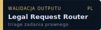](./fundament-weryfikacyjny/skills/legal-request-router-pl) | Klasyfikator zadania - decyduje, ktora sciezka weryfikacji uruchomic. Warstwa NAD walidacja. | Apache-2.0 | 1.0.0 |
| [](./fundament-weryfikacyjny/skills/intake-sufficiency-pl) | Ocena czy zlecenie/brief MA dosc kontekstu, by zaczac. Generuje pytania do klienta. | Apache-2.0 | 1.0.0 |
| [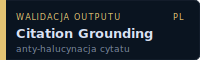](./fundament-weryfikacyjny/skills/citation-grounding-pl) | Mechaniczny weryfikator cytatu - string-match cytatu prawnego w zrodle. Anti-halucynacja. | Apache-2.0 | 1.0.0 |
| [](./fundament-weryfikacyjny/skills/adversarial-legal-review-pl) | Czerwony zespol dla pisma wysokiej stawki - builder/attacker/synthesizer/verifier. | Apache-2.0 | 1.0.0 |
| [](./fundament-weryfikacyjny/skills/deliverable-fidelity-pl) | Czy zadna flaga RED nie wypadla z podsumowania - sprawdza wiernosc finalnego pisma do analizy. | Apache-2.0 | 1.0.0 |
| [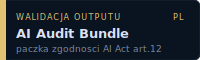](./fundament-weryfikacyjny/skills/legal-ai-audit-bundle) | Artefakt audytowy AI Act art. 12 - deliverable + slad + log kosztu + manifest SHA256. | Apache-2.0 | 1.0.0 |

### Plugin `orzecznictwo-zrodla` (Orzecznictwo PL / UE + konektory)

Bundle ze zrodlami. Niesie konektory MCP `saos`, `krs`, `eu-sparql` (read-only, publiczne API; wymaga node/npx) plus `webwright-legal-pl` do serwisow niedostepnych przez MCP. Instalacja: `/plugin install orzecznictwo-zrodla@matematic-skills-pl`.

| Skill | Opis | Licencja | Wersja |
|---|---|---|---|
| [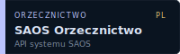](./orzecznictwo-zrodla/skills/saos-orzecznictwo) | Polish case law search via SAOS REST API - sady powszechne, SN, TK, KIO. Lean SKILL.md (125 linii) + `references/api.md`. | Apache-2.0 | 2026.05.27 |
| [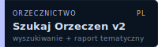](./orzecznictwo-zrodla/skills/szukaj-orzeczen-v2) | Wyszukiwanie orzeczen PL + opcjonalne grupowanie tematyczne (klastrowanie, raport DOCX). v2.1.0: SKILL.md 460->60 linii + 4 pliki `references/`. | Apache-2.0 | 2.1.0 |
| [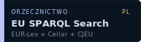](./orzecznictwo-zrodla/skills/eu-sparql-search) | EUR-Lex / Cellar SPARQL - akty UE i orzecznictwo TSUE, CELEX, ELI URI. | Apache-2.0 | 2026.05.24 |
| [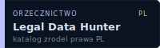](./orzecznictwo-zrodla/skills/legal-data-hunter-pl) | Catalog + bulk-harvest dla 11 polskich zrodel prawnych (UODO, UOKiK, KNF, KIO, NSA, TK, SN, Sejm ELI). | Apache-2.0 | 2026.05.22 |
| [](./orzecznictwo-zrodla/skills/webwright-legal-pl) | Pobiera orzeczenia z serwisow niedostepnych w MCP (orzeczenia.ms.gov.pl, sn.pl po 2016, trybunal.gov.pl, EUR-Lex PL) przez Playwright. | Apache-2.0 | 1.0.1 |

### Plugin `dokumenty` (konwersja, redline, anonimizacja)

Operacje na dokumentach, bez konektorow. Instalacja: `/plugin install dokumenty@matematic-skills-pl`.

| Skill | Opis | Licencja | Wersja |
|---|---|---|---|
| [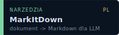](./dokumenty/skills/markitdown) | Microsoft MarkItDown - PDF/Word/Excel/PPT/HTML/EPUB/audio/obrazy/YouTube -> Markdown. | MIT | 2026.04.21 |
| [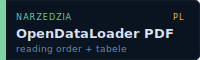](./dokumenty/skills/opendataloader-pdf) | Wysokiej jakosci PDF -> JSON/MD: reading order, tabele, headings. Krytyczne dla KRS i postanowien. | Apache-2.0 | 2026.04.21 |
| [](./dokumenty/skills/redline-docx-pl) | Natywne Word Track Changes w polskich .docx + sanitize metadanych autora (RODO przy wysylce). Safety Tiers R/M/D. | MIT | 2026.05.27 |
| [](./dokumenty/skills/let-it-be) | Silnik anonimizacji i pseudonimizacji polskich PII (PESEL, NIP, REGON, KRS, IBAN, imiona, firmy) w tekscie. Offline, deterministyczny, zero zaleznosci. | Apache-2.0 | 1.0.0 |

### Plugin `governance-kancelarii` (governance AI dla kancelarii)

Generatory governance i operacyjne, bez konektorow. Instalacja: `/plugin install governance-kancelarii@matematic-skills-pl`.

| Skill | Opis | Licencja | Wersja |
|---|---|---|---|
| [](./governance-kancelarii/skills/matematic-konstytucja-ai) | Generuje "Konstytucje AI" - dokument governance dla kancelarii (6 sekcji + AI Implementation Playbook 6-8 tygodni). Cherry-pick patternu github/spec-kit. | Apache-2.0 | 1.0.0 |
| [](./governance-kancelarii/skills/matematic-expert-panel) | Generuje 90-min warsztat multi-perspective dla zarzadu kancelarii - 7 person (compliance / IT security / etyk / partner / junior / klient / regulator). | Apache-2.0 | 1.0.0 |
| [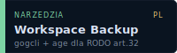](./governance-kancelarii/skills/matematic-workspace-backup) | Szyfrowany backup Google Workspace przez gogcli + age + prywatne repo Git. Adresuje RODO art. 32 (ciaglosc, ochrona przed lockoutem). | Apache-2.0 | 1.0.0 |

### Plugin `jakosc-tresci` (jakosc tekstu polskiego)

Narzedzia redakcyjne, neutralne tematycznie, bez konektorow. Zmieniaja slowa, nigdy faktow. Instalacja: `/plugin install jakosc-tresci@matematic-skills-pl`.

| Skill | Opis | Licencja | Wersja |
|---|---|---|---|
| [](./jakosc-tresci/skills/humanizer-pl) | Usuwa wzorce AI-slop z polskiego tekstu (34 wzorce), w tym sygnatury statystyczne wykrywane przez detektory: burstiness, dystrybucja czesci mowy, gestosc i roznorodnosc leksykalna, zakres emocji. | MIT | 1.1.0 |
| [](./jakosc-tresci/skills/marko-pl-content) | Zrzedliwy senior redaktor - werdykt (katastrofa/slabe/przecietne/ok) + lista zarzutow z `plik:linia`. Wskazuje co zle, nie przepisuje. | MIT | 1.0.0 |

### Plugin `ochrona-danych` (operacje RODO dla kancelarii i IOD)

Operacyjne narzedzia RODO ugruntowane w artykulach rozporzadzenia i wytycznych EROD/UODO, bez konektorow. Kazdy sklada draft do decyzji; akt na zewnatrz (zgloszenie, wysylka, usuniecie, podpis) zostaje czlowiekowi. Instalacja: `/plugin install ochrona-danych@matematic-skills-pl`.

| Skill | Opis | Licencja | Wersja |
|---|---|---|---|
| [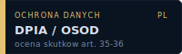](./ochrona-danych/skills/rodo-dpia-pl) | Ocena skutkow dla ochrony danych (DPIA / OSOD): test czy wymagane (9 kryteriow EROD), struktura art. 35 ust. 7, uprzednie konsultacje art. 36. Deterministyczny przesiew progu. | Apache-2.0 | 1.1.0 |
| [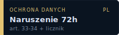](./ochrona-danych/skills/rodo-naruszenie-72h-pl) | Obsluga naruszenia ochrony danych w 72h: drzewo decyzyjne, ocena ryzyka, zgloszenie do UODO (art. 33) z licznikiem, zawiadomienie osob (art. 34). Deterministyczny kalkulator terminu 72h. | Apache-2.0 | 1.1.0 |
| [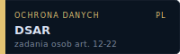](./ochrona-danych/skills/rodo-dsar-pl) | Obsluga zadan osob (DSAR): klasyfikacja praw art. 15-22, licznik terminu art. 12 ust. 3, bramki wyjatkow i odmow, draft odpowiedzi + rejestr. Deterministyczny kalkulator terminu miesiecznego (Reg. 1182/71). | Apache-2.0 | 1.1.0 |
| [](./ochrona-danych/skills/rodo-ropa-dpa-pl) | Rejestr czynnosci przetwarzania (RoPA, art. 30) + przeglad umow powierzenia (DPA, art. 28 ust. 3 lit. a-h) z redline brakujacych klauzul. Deterministyczna kontrola klauzul a-h. | Apache-2.0 | 1.1.0 |

### Plugin `dev-mcp` (narzedzia deweloperskie, advanced)

Warsztat deweloperski MateMatic, bez konektorow. Instalacja: `/plugin install dev-mcp@matematic-skills-pl`.

| Skill | Opis | Licencja | Wersja |
|---|---|---|---|
| [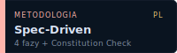](./dev-mcp/skills/matematic-spec-driven) | Spec-Driven Development dla wewnetrznych projektow MateMatic - 4 fazy (Konstytucja / Specyfikacja / Plan / Zadania) + Constitution Check GATE. | Apache-2.0 | 0.1.0 |
| [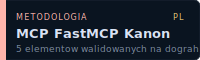](./dev-mcp/skills/matematic-mcp-fastmcp-instructions-pl) | Kanon dla MCP serverow MateMatic - FastMCP/Server(instructions=) + drift test + dwukanalowy auth + OTel org_id + ToolAnnotations. Walidowany na dograh v1.31.0 (BSD-2), zaadoptowany w 6 MCP MateMatic 2026-05-25. | Apache-2.0 | 1.0.0 |
| [](./dev-mcp/skills/matematic-patron-pr-review-pl) | Recenzent PR/diffow dla LegalTech AI agentow - org scoping multi-tenant, audit_log AI Act art. 12, citation grounding, PII w logach. 14 sekcji, 3 buckets Blocker/Should-fix/Nit. Cherry-pick z dograh review-pr (BSD-2) + 3 sekcje MateMatic-specific. | Apache-2.0 | 1.0.0 |
| [](./dev-mcp/skills/matematic-marketplace-installer) | Generator skryptow instalacyjnych MateMatic Marketplace dla prawnikow (Windows .bat, bez Git/npm). Reproducible install: default ref = najnowszy tag. Safety Tiers R/M/D. | Apache-2.0 | 1.0.0 |

---

## Pokrewne repozytoria - reszta ekosystemu MateMatic

Pakiet wyzej to warstwa walidacji outputu i narzedzia konwersji. Pelny ekosystem to 15 publicznych repo na [github.com/matematicsolutions](https://github.com/matematicsolutions).

### Konektory MCP polskiego i unijnego prawa

| Repo | Co indeksuje |
|---|---|
| [mcp-saos](https://github.com/matematicsolutions/mcp-saos) | Orzecznictwo PL z API SAOS (536k orzeczen powszechnych) |
| [mcp-nsa](https://github.com/matematicsolutions/mcp-nsa) | NSA + 16 WSA via CBOSA (prawo administracyjne, RODO, podatki) |
| [mcp-isap](https://github.com/matematicsolutions/mcp-isap) | Sejm ELI (Dziennik Ustaw + Monitor Polski, 96k+ aktow od 1918) |
| [mcp-krs](https://github.com/matematicsolutions/mcp-krs) | KRS via API MS (spolki, KRS-y, sprawozdania) |
| [mcp-eu-sparql](https://github.com/matematicsolutions/mcp-eu-sparql) | EUR-Lex / Cellar SPARQL (prawo UE) |
| [mcp-eu-compliance](https://github.com/matematicsolutions/mcp-eu-compliance) | Offline korpus EU law (GDPR, AI Act, DORA, NIS2, eIDAS 2.0, CRA) - lokalna SQLite FTS5 |

### Pluginy Claude Code

| Repo | Zastosowanie |
|---|---|
| [matematic-legal-verify-pl](https://github.com/matematicsolutions/matematic-legal-verify-pl) | 4 skille walidacji w jednym plugin: router / grounding / adversarial / audit-bundle |
| [matematic-anonimizacja-pl](https://github.com/matematicsolutions/matematic-anonimizacja-pl) | Silnik anonimizacji PESEL/NIP/REGON/KRS/imion/firm - offline, RODO-safe |
| [matematic-contract-review-pl](https://github.com/matematicsolutions/matematic-contract-review-pl) | Bulk audit portfela umow (NDA/M&A/dostawcze/RODO) - tabular review, pseudonimizacja PII przed LLM |
| [matematic-pomoc-prawna-pl](https://github.com/matematicsolutions/matematic-pomoc-prawna-pl) | Plugin dla nieodplatnej pomocy prawnej, klinik prawa, fundacji i NGO |
| [lpm-pl](https://github.com/matematicsolutions/lpm-pl) | Legal Project Management - status raporty z RAG, scope-change, RAID ryzyk |

### Inne

| Repo | Co to |
|---|---|
| [patron](https://github.com/matematicsolutions/patron) | Lokalny RODO-safe agent AI dla polskich kancelarii. Self-host, audit trail hash-chain, bring-your-own-model. |
| [matematic-readiness](https://github.com/matematicsolutions/matematic-readiness) | Audyt gotowosci kancelarii do AI - 30 pytan, 5 wymiarow, scoring 1-5 + framework Build vs Buy. CC BY-SA 4.0. |
| [praxis](https://github.com/matematicsolutions/praxis) | Praktyczne przewodniki LegalTech/AI governance. CC BY-SA 4.0. |

---

## Instalacja

Trzy drogi. **A** (`npx skills`) dziala w **dowolnym agencie** wspierajacym format Agent Skills (Cursor, OpenAI Codex, Windsurf, Gemini CLI, Claude Code) i instaluje pojedyncze skille. **B** to natywny marketplace Claude Code - instaluje calymi bundlami, z zachowaniem granic pluginu i jego inline `CLAUDE.md`. **C** to reczny symlink jednego skilla.

**Co zainstalowac.** Kancelaria zaczyna od `fundament-weryfikacyjny` (rdzen walidacji) i `orzecznictwo-zrodla` (zrodla PL/UE), a `dokumenty`, `governance-kancelarii`, `jakosc-tresci` i `ochrona-danych` dobiera wedlug potrzeb. Bundle `dev-mcp` to warsztat dla deweloperow - pomin go, jesli nie budujesz skilli ani serwerow MCP. Caly hub jedna komenda (`npx skills add ...` bez `--skill`) wciaga wszystkie 28 skille naraz; wiekszosc kancelarii woli `--skill` albo `/plugin install` wybranych bundli.

### A. Dowolny agent - `npx skills` (cross-agent)

```bash
# Caly hub - wszystkie skille z bundli, wykrywane rekursywnie po SKILL.md
npx skills add matematicsolutions/awesome-matematic-skills-pl

# Tylko wybrane skille - cherry-pick po nazwie z frontmatter
npx skills add matematicsolutions/awesome-matematic-skills-pl --skill citation-grounding-pl marko-pl-content
```

`npx skills` ([vercel-labs/skills](https://github.com/vercel-labs/skills)) pobiera pliki `SKILL.md` i instaluje je do katalogu agenta (`.claude/skills/` albo `.agents/skills/`, zaleznie od narzedzia). Dziala wszedzie, gdzie dziala format Agent Skills - nie tylko w Claude Code. Ta droga instaluje same skille. Konektory MCP (bundle `orzecznictwo-zrodla` i `multi-jurysdykcja-ue`) wymagaja konfiguracji pluginu, wiec instaluj je metoda B.

### B. Claude Code - plugin marketplace (natywnie, instaluje bundlami)

```bash
# 1. Dodaj marketplace (raz)
/plugin marketplace add matematicsolutions/awesome-matematic-skills-pl

# 2. Zainstaluj bundle, ktorych potrzebujesz
/plugin install fundament-weryfikacyjny@matematic-skills-pl    # rdzen weryfikacyjny, bez konektorow
/plugin install orzecznictwo-zrodla@matematic-skills-pl         # zrodla PL/UE + konektory saos/krs/eu-sparql
/plugin install dokumenty@matematic-skills-pl                   # konwersja, redline, anonimizacja
/plugin install governance-kancelarii@matematic-skills-pl       # Konstytucja AI, Expert Panel, backup
/plugin install dev-mcp@matematic-skills-pl                      # narzedzia deweloperskie (advanced)
```

Fundament dziala bez zadnych konektorow i niczego nie wysyla na zewnatrz. Plugin `orzecznictwo-zrodla` uruchamia konektory MCP przez `npx`, wiec wymaga `node` w srodowisku. Wszystkie 28 umiejetnosci sa w bundlach - nic nie lezy juz pojedynczo.

### C. Pojedynczy skill jako symlink do ~/.claude/skills/

```powershell
# PowerShell - przyklad citation-grounding-pl (z bundla fundament-weryfikacyjny)
New-Item -ItemType SymbolicLink `
  -Path "$env:USERPROFILE\.claude\skills\citation-grounding-pl" `
  -Target "C:\sciezka\do\awesome-matematic-skills-pl\fundament-weryfikacyjny\skills\citation-grounding-pl"
```

```bash
# Bash / WSL
ln -s "$(pwd)/fundament-weryfikacyjny/skills/citation-grounding-pl" ~/.claude/skills/citation-grounding-pl
```

---

## Dlaczego polski hub

1. **Polskie organy maja wlasna semantyke.** UODO nie jest tylko ICO/CNIL. KIO ma wlasny tryb 23-dniowy. NSA orzeka kasacyjnie inaczej niz Bundesverwaltungsgericht. Globalny „GDPR + NDA review" tego nie pokrywa.
2. **Tajemnica zawodowa.** Art. 6 PrAdw + art. 3 RadcPrU + tajemnica notarialna + tajemnica komornicza. Wysylka cloud do US bez SCC = naruszenie. Wszystkie nasze skille sa **RODO-safe by default** (lokalna inference albo izolacja).
3. **AI Act art. 12 + art. 13.** Obowiazek prowadzenia rejestru zdarzen (art. 12) i transparency duty (art. 13). [legal-ai-audit-bundle](./fundament-weryfikacyjny/skills/legal-ai-audit-bundle) pakuje to natywnie. Zachodnie huby dopiero o tym dyskutuja.
4. **Polski jezyk.** Modele LLM popelniaja inne bledy w polszczyznie (kalki anglicyzmow, naduzycie em-dash, hedging). Hub zawiera narzedzia do wykrywania i poprawy tych wzorcow przed publikacja.

---

## Kontrybucje

Patrz [CONTRIBUTING.md](CONTRIBUTING.md). Hub jest otwarty dla polskich prawnikow, in-house counseli, naukowcow prawa, legaltechow i NGO.

Triage PR-ow przez [Wieslaw Mazur](https://www.linkedin.com/in/wieslawmazur/).

## Gdzie dzialaja te skille

Skille trzymaja sie [formatu Agent Skills](https://github.com/anthropics/skills) (Anthropic, otwarty standard). Dzialaja w:

- Claude Code, Claude Cowork, Claude.ai
- OpenAI Codex CLI
- Gemini CLI
- Manus
- Mistral Vibe
- Dowolny IDE/CLI ktory implementuje format

Wybor modelu LLM nalezy do uzytkownika. Hub jest vendor-agnostic z zalozenia.

## Licencja

- Kuratorska (README, taksonomia, marketplace.json): **MIT**
- Per-skill: licencja deklarowana w `SKILL.md` frontmatter (default Apache-2.0 dla MateMatic, MIT lub CC-BY-SA-4.0 dla niektorych komponentow)
- Cytaty prawne i orzecznictwo: copyright wlasciwy zrodlu (Lex/Legalis/SAOS/CBOSA/ELI)

## Kontakt

[matematicsolutions.com](https://matematicsolutions.com) | [LinkedIn Wieslaw Mazur](https://www.linkedin.com/in/wieslawmazur/) | [github.com/matematicsolutions](https://github.com/matematicsolutions)
